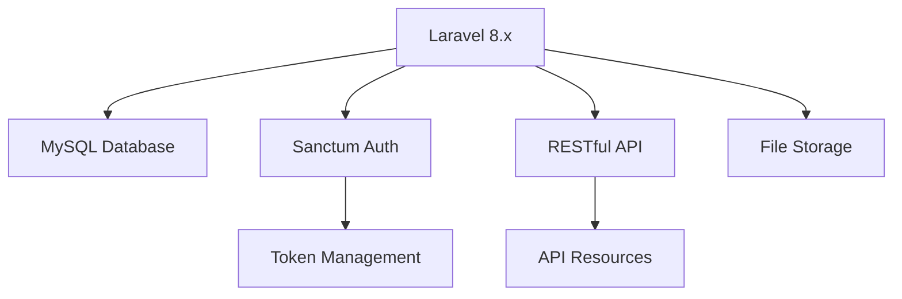
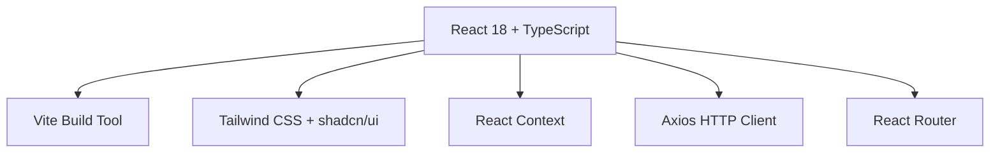

<div align="center">

# 📦 GudangKu - Warehouse Management System

*Modern warehouse management system built with Laravel & React*

[](https://laravel.com)
[](https://reactjs.org)
[](https://www.typescriptlang.org)
[](https://tailwindcss.com)
[](https://mysql.com)

[🚀 Live Demo](https://gudangku-demo.vercel.app) • [📖 Documentation](https://github.com/mandao-online/gudangku/wiki) • [🐛 Report Bug](https://github.com/mandao-online/gudangku/issues) • [💡 Request Feature](https://github.com/mandao-online/gudangku/issues)

</div>

---

## 📸 Screenshots

<div align="center">

### 🏠 Dashboard Overview
*Real-time inventory statistics and activity monitoring*

### 📦 Inventory Management
*Complete stock management with barcode scanning*

### 👥 User & Attendance System
*Role-based access control and attendance tracking*

</div>

## ✨ Key Features

<table>
<tr>
<td width="50%">

### 📊 **Smart Dashboard**
- 📈 Real-time inventory analytics
- � Detailned stock & transaction modals
- 👥 Employee attendance overview
- 📋 Recent activity tracking
- 🎯 Low stock alerts

### 📦 **Advanced Inventory**
- ✅ Full CRUD with categories & units
- 📱 Barcode scanner integration
- 📊 Stock movement tracking
- 🗂️ Soft delete with restore
- 🖼️ Image upload with compression
- 📤 Export to CSV/Excel

</td>
<td width="50%">

### 👥 **User Management**
- 🔐 Role-based access control
- 👤 Profile management with avatars
- 📱 Phone-based authentication
- 📊 User activity tracking
- 🛡️ Secure session management

### ⏰ **Attendance System**
- 📍 GPS-based check-in/out
- 📸 Photo verification
- 📊 Excel export capabilities
- 🌍 Timezone support
- 👨‍💼 Admin management dashboard

</td>
</tr>
</table>

## 🛠️ Tech Stack

<div align="center">

### Backend Architecture


### Frontend Architecture


</div>

| Category | Technology | Purpose |
|----------|------------|---------|
| **Backend** | Laravel 8.x | PHP Framework |
| **Database** | MySQL 8.x | Data Storage |
| **Authentication** | Laravel Sanctum | API Authentication |
| **Frontend** | React 18 + TypeScript | User Interface |
| **Styling** | Tailwind CSS + shadcn/ui | UI Components |
| **Build Tool** | Vite | Fast Development |
| **State Management** | React Context | Global State |
| **HTTP Client** | Axios | API Communication |

## 📁 Project Structure

```
gudangku/
├── backend/          # Laravel API
│   ├── app/
│   ├── database/
│   ├── routes/
│   └── ...
├── frontend/         # React App
│   ├── src/
│   ├── public/
│   └── ...
└── README.md
```

## 🚀 Quick Start

<div align="center">

### 🎯 One-Command Setup (Coming Soon)
```bash
curl -sSL https://raw.githubusercontent.com/mandao-online/gudangku/main/install.sh | bash
```

</div>

### 📋 Prerequisites

Make sure you have these installed:

-  PHP 7.4 or higher
-  Composer
-  Node.js 16 or higher
-  MySQL 8.0 or higher

### 🔧 Backend Setup

<details>
<summary>Click to expand backend setup steps</summary>

1. **📁 Navigate to backend directory**
   ```bash
   cd backend
   ```

2. **📦 Install PHP dependencies**
   ```bash
   composer install
   ```

3. **⚙️ Environment configuration**
   ```bash
   cp .env.example .env
   php artisan key:generate
   ```

4. **🗄️ Database configuration**
   
   Edit your `.env` file:
   ```env
   DB_CONNECTION=mysql
   DB_HOST=127.0.0.1
   DB_PORT=3306
   DB_DATABASE=gudangku_database
   DB_USERNAME=your_database_username
   DB_PASSWORD=your_database_password
   ```

5. **🚀 Database setup**
   ```bash
   php artisan migrate
   php artisan db:seed
   ```

6. **🔗 Storage link**
   ```bash
   php artisan storage:link
   ```

7. **▶️ Start development server**
   ```bash
   php artisan serve --port=8001
   ```

</details>

### 🎨 Frontend Setup

<details>
<summary>Click to expand frontend setup steps</summary>

1. **📁 Navigate to frontend directory**
   ```bash
   cd frontend
   ```

2. **📦 Install Node.js dependencies**
   ```bash
   npm install
   # or
   yarn install
   ```

3. **⚙️ Environment setup**
   ```bash
   cp .env.example .env
   ```

4. **▶️ Start development server**
   ```bash
   npm run dev
   # or
   yarn dev
   ```

</details>

### 🌐 Access Points

| Service | URL | Description |
|---------|-----|-------------|
| 🎨 **Frontend** | http://localhost:5173 | React Development Server |
| 🔧 **Backend API** | http://localhost:8001/api | Laravel API Endpoints |
| 📚 **API Docs** | http://localhost:8001/api/documentation | Swagger Documentation |

## 👤 Demo Accounts

<div align="center">

| 🎭 Role | 📱 Phone | 🔑 Password | 👤 Name | 🔐 Permissions |
|---------|----------|-------------|---------|----------------|
| 👑 **Admin** | `0811545857` | `password` | Administrator | Full Access |
| 👑 **Admin** | `081154105490` | `password` | Rizal Fatih | Full Access |
| 👨‍💼 **Manager** | `08123412341234` | `password` | Siti Nurhaliza | Limited Access |

</div>

> 💡 **Tip**: Use any of these accounts to explore different permission levels

## 📱 Mobile Support

Aplikasi fully responsive dan mendukung:
- Touch gestures
- Mobile-first design
- PWA capabilities
- Offline support (coming soon)

## 🔧 Development

### Backend Commands
```bash
# Run tests
php artisan test

# Clear cache
php artisan cache:clear
php artisan config:clear
php artisan view:clear

# Generate API documentation
php artisan l5-swagger:generate
```

### Frontend Commands
```bash
# Build for production
npm run build

# Preview production build
npm run preview

# Run linting
npm run lint

# Type checking
npm run type-check
```

## 📊 API Documentation

API documentation tersedia di `/api/documentation` setelah menjalankan:
```bash
php artisan l5-swagger:generate
```

## 🚀 Deployment

### Backend (Laravel)
1. Upload files ke server
2. Install dependencies: `composer install --optimize-autoloader --no-dev`
3. Set environment: `cp .env.example .env`
4. Generate key: `php artisan key:generate`
5. Run migrations: `php artisan migrate --force`
6. Optimize: `php artisan optimize`

### Frontend (React)
1. Build: `npm run build`
2. Upload `dist/` folder ke web server
3. Configure web server untuk SPA routing

## 🤝 Contributing

We love contributions! Here's how you can help make GudangKu better:

<div align="center">

### 🌟 Ways to Contribute

| Type | Description | How to Help |
|------|-------------|-------------|
| 🐛 **Bug Reports** | Found a bug? | [Create an issue](https://github.com/mandao-online/gudangku/issues/new?template=bug_report.md) |
| 💡 **Feature Requests** | Have an idea? | [Request a feature](https://github.com/mandao-online/gudangku/issues/new?template=feature_request.md) |
| 📝 **Documentation** | Improve docs | Edit files and submit PR |
| 🔧 **Code** | Fix bugs or add features | Follow the guide below |

</div>

### 🚀 Development Workflow

1. **🍴 Fork the repository**
   ```bash
   git clone https://github.com/your-username/gudangku.git
   ```

2. **🌿 Create a feature branch**
   ```bash
   git checkout -b feature/amazing-feature
   ```

3. **💻 Make your changes**
   - Write clean, documented code
   - Follow existing code style
   - Add tests if applicable

4. **✅ Test your changes**
   ```bash
   # Backend tests
   cd backend && php artisan test
   
   # Frontend tests
   cd frontend && npm run test
   ```

5. **📝 Commit with conventional commits**
   ```bash
   git commit -m "feat: add amazing feature"
   ```

6. **🚀 Push and create PR**
   ```bash
   git push origin feature/amazing-feature
   ```

### 📋 Code Style Guidelines

- **PHP**: Follow PSR-12 standards
- **JavaScript/TypeScript**: Use Prettier + ESLint
- **Commits**: Use [Conventional Commits](https://conventionalcommits.org/)
- **Documentation**: Update README for new features

## 📝 License

This project is licensed under the MIT License.

## 🆘 Support

Untuk bantuan dan pertanyaan:
- Create an issue di GitHub
- Email: support@gudangku.com

## 🎯 Roadmap

<div align="center">

### 🚧 Coming Soon

</div>

| Status | Feature | Description | Priority |
|--------|---------|-------------|----------|
| 🔄 | **Real-time Notifications** | WebSocket-based live updates | High |
| 📊 | **Advanced Analytics** | Detailed reports and insights | High |
| 🏢 | **Multi-warehouse Support** | Manage multiple locations | Medium |
| 🛒 | **E-commerce Integration** | Connect with online stores | Medium |
| 📱 | **Mobile App** | React Native mobile version | Low |
| 🖨️ | **Barcode Printing** | Generate and print barcodes | Low |

### 🎉 Recently Completed

- ✅ PWA Support with offline capabilities
- ✅ Image compression for better performance
- ✅ Barcode scanner integration
- ✅ Advanced user management
- ✅ Attendance system with GPS

---

<div align="center">

## 📞 Support & Community

[](https://github.com/mandao-online/gudangku/issues)
[](https://github.com/mandao-online/gudangku/discussions)
[](https://discord.gg/gudangku)

### 💬 Get Help

- 🐛 **Bug Reports**: [GitHub Issues](https://github.com/mandao-online/gudangku/issues)
- 💡 **Feature Requests**: [GitHub Discussions](https://github.com/mandao-online/gudangku/discussions)
- 📧 **Email Support**: support@gudangku.com
- 💬 **Community Chat**: [Join our Discord](https://discord.gg/gudangku)

</div>

---

<div align="center">

## 📄 License

This project is licensed under the **MIT License** - see the [LICENSE](LICENSE) file for details.

---

### 🌟 Show Your Support

If this project helped you, please consider giving it a ⭐️!

[](https://github.com/mandao-online/gudangku/stargazers)
[](https://github.com/mandao-online/gudangku/network/members)

**Made with ❤️ by the GudangKu Team**

[⬆️ Back to Top](#-gudangku---warehouse-management-system)

</div>